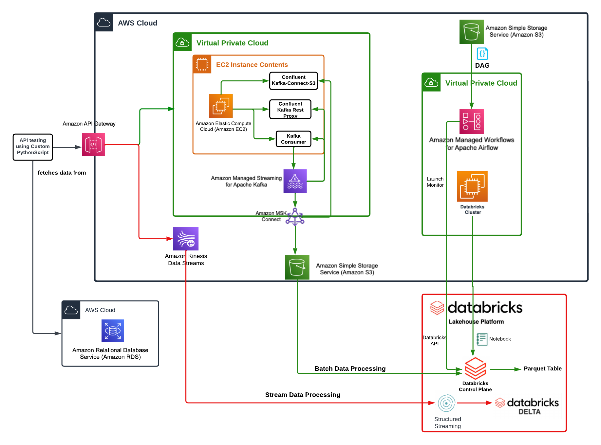
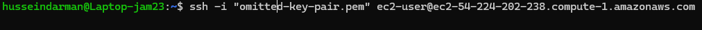
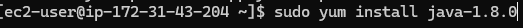
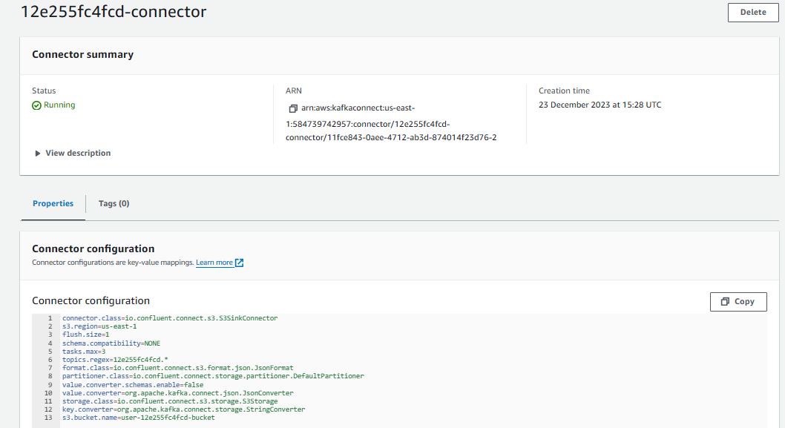
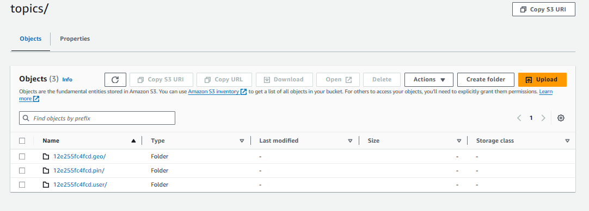
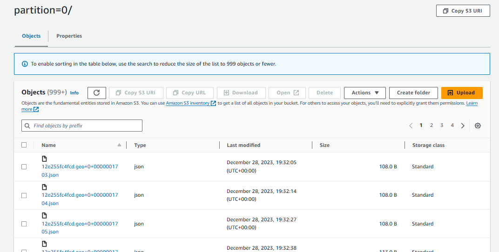

## PinInterest-Data-Pipeline

### The Pinterest data pipeline, crunches billions of data points every day to decide and faciliate how to provide more value to their users base. Through the use of cloud providers and a distributed event store and stream-processing platform such as Kafka, I will mimick a data-engineering project that will handle a similar workload

## Project Dependencies

In order to run this project the following needs to be installed:

* python-dotenv
* sqlalchemy
* requests

If you are using Anaconda and virtual environments (recommended), the Conda environment can be cloned by running the following command, ensuring that env.yml is present in the project:

'conda create env -f env.yml -n $ENVIRONMENT_NAME'

## Tools Used

Apache Kafka - Apache Kafka is an event streaming platform. From the Kafka documentation:

> Event streaming is the practice of capturing data in real-time from event sources like databases, sensors, mobile devices, cloud services, and software applications in the form of streams of events; storing these event streams durably for later retrieval; manipulating, processing, and reacting to the event streams in real-time as well as retrospectively; and routing the event streams to different destination technologies as needed. Event streaming thus ensures a continuous flow and interpretation of data so that the right information is at the right place, at the right time.

AWS MSK - Amazon Managed Streaming for Apache Kafka (Amazon MSK) is a fully managed service that enables you to build and run applications that use Apache Kafka to process streaming data. More information can be found in the developer guide.

AWS MSK Connect - MSK Connect is a feature of Amazon MSK that makes it easy for developers to stream data to and from their Apache Kafka clusters. From the developer guide:

> With MSK Connect, you can deploy fully managed connectors built for Kafka Connect that move data into or pull data from popular data stores like Amazon S3... Use source connectors to import data from external systems into your topics. With sink connectors, you can export data from your topics to external systems.

Kafka REST Proxy - From the docs:

> The Confluent REST Proxy provides a RESTful interface to an Apache Kafka® cluster, making it easy to produce and consume messages, view the state of the cluster, and perform administrative actions without using the native Kafka protocol or clients.

AWS API Gateway -

> Amazon API Gateway is a fully managed service that makes it easy for developers to create, publish, maintain, monitor, and secure APIs at any scale. APIs act as the "front door" for applications to access data, business logic, or functionality from your backend services.

Apache Spark - 

Apache Spark™ is a multi-language engine for executing data engineering, data science, and machine learning on single-node machines or clusters. From the docs:

> Spark provides high-level APIs in Java, Scala, Python, and R, and an optimized engine that supports general execution graphs. It also supports a rich set of higher-level tools including Spark SQL for SQL and structured data processing, pandas API on Spark for pandas workloads, MLlib for machine learning, GraphX for graph processing, and Structured Streaming for incremental computation and stream processing.

PySpark - PySpark is the Python API for Apache Spark.

> It enables you to perform real-time, large-scale data processing in a distributed environment using Python. It also provides a PySpark shell for interactively analyzing your data. PySpark combines Python’s learnability and ease of use with the power of Apache Spark to enable processing and analysis of data at any size for everyone familiar with Python.

Databricks - 

> This project uses the Databricks platform to perform Spark processing of batch and streaming data. From the documentation:
Databricks is a unified, open analytics platform for building, deploying, sharing, and maintaining enterprise-grade data, analytics, and AI solutions at scale. The Databricks Lakehouse Platform integrates with cloud storage and security in your cloud account, and manages and deploys cloud infrastructure on your behalf.

Managed Workflows for Apache Airflow - 

> Apache Airflow enables users to use Python to build scheduling workflows for batch-oriented processes. This project uses MWAA to orchestrate batch processing on the Databricks platform. From AWS docs:
With Amazon MWAA, you can use Apache Airflow and Python to create workflows without having to manage the underlying infrastructure for scalability, availability, and security.

AWS Kinesis - 

> AWS Kinesis is a managed service for processing and analysing streaming data. In this project I've used Kinesis Data Streams to collect and store data temporarily before using Spark on Databricks to read and process the stream


## Architecture: PinInterest Data Pipeline




## Pre-requistes 


### AWS Identity and Access Management (IAM)

There are two distinct IAM roles that facilite the use of this architecture, EC2 access role [A linnk to EC2 access role configuration](https://docs.aws.amazon.com/AWSEC2/latest/UserGuide/iam-roles-for-amazon-ec2.html) and Kinesis access role [A link to Kinesis access role configuration](https://docs.aws.amazon.com/streams/latest/dev/controlling-access.html)

### Enable client machine to connect to the cluster

In order for the client machine to connect to the cluster, we need to edit the inbound rules for the security group associated with the cluster.

1. In the left-hand EC2 menu, click on 'Security Groups'.
2. Select the security group associated with the Kafka cluster (noted earlier).
3. Select the 'Inbound rules' tab and then click on 'Edit inbound rules'.
4. Click on 'Add rule'. Choose 'All traffic' for the type, and then select the security group associated with the EC2 instance.
Save the rules.

#### We also need to create an IAM role for the client machine.

Navigate to the AWS IAM dashboard, select 'Roles' from the left-hand menu and then click on 'Create role'. 
Select 'AWS service' and 'EC2', then click on 'Next'.
On the next page, select 'Create policy'.
In the policy editor, choose JSON format and paste in the following policy. Note: this policy is somewhat open - a more restrictive policy would be more appropriate for a production environment
'''
{
    "Version": "2012-10-17",
    "Statement": [
        {
            "Sid": "VisualEditor0",
            "Effect": "Allow",
            "Action": [
                "kafka:ListClustersV2",
                "kafka:ListVpcConnections",
                "kafka:DescribeClusterOperation",
                "kafka:GetCompatibleKafkaVersions",
                "kafka:ListClusters",
                "kafka:ListKafkaVersions",
                "kafka:GetBootstrapBrokers",
                "kafka:ListConfigurations",
                "kafka:DescribeClusterOperationV2"
            ],
            "Resource": "*"
        },
        {
            "Sid": "VisualEditor1",
            "Effect": "Allow",
            "Action": "kafka-cluster:*",
            "Resource": [
                "arn:aws:kafka:*:<AWS-UUID>:transactional-id/*/*/*",
                "arn:aws:kafka:*:<AWS-UUID>:group/*/*/*",
                "arn:aws:kafka:*:<AWS-UUID>:topic/*/*/*",
                "arn:aws:kafka:*:<AWS-UUID>:cluster/*/*"
            ]
        },
        {
            "Sid": "VisualEditor2",
            "Effect": "Allow",
            "Action": "kafka:*",
            "Resource": [
                "arn:aws:kafka:*:<AWS-UUID>:cluster/*/*",
                "arn:aws:kafka:*:<AWS-UUID>:configuration/*/*",
                "arn:aws:kafka:*:<AWS-UUID>:vpc-connection/*/*/*"
            ]
        }
    ]
}
'''
1. On the next page, give the policy a descriptive name and save the policy.
2. Back in the create role tab in the browser, click refresh to show the new policy and select the policy.
3. Click 'Next', give the role a descriptive name and save the role.
4. In the EC2 dashboard, click on the client instance.
5. Under 'Actions' and 'Security', click on 'Modify IAM role'.
6. Select the role just created and click on 'Update IAM role'.

## Configuring EC2 Kafka client

To Configure an Amazon EC2 instance for Kafka Client, firstly navigate to EC2 services on AWS Management Console.

The setting used to configure the **Amazon machine image** is **amzn2-ami-kernel-5.10-hvm-2.0.20221103.3-x86_64-gp2** which means as follows:

**Amazon Linux 2** AMI. Pre-configured virtual machine image that I can use to launch instances on Amazon Elastic Compute Cloud (Amazon EC2).
**Kernel 5.10**: The AMI is built with Linux kernel version 5.10. This kernel version brings various features, optimizations, and security enhancements.
**HVM (Hardware Virtual Machine)**: HVM is a virtualization mode that allows running guest operating systems directly on the host’s hardware. It provides better performance compared to other virtualization modes.
**x86_64**: 64-bit x86 architecture.
**gp2**: This refers to the General Purpose SSD (gp2) volume type. It provides a balance of performance and cost-effectiveness.

The **instance type** is **t2.micro**

For security reasons, the creation of a key-pair is needed and further to remotely access the EC2 instance. I've made a key-pair.pem file which is ommitted from the repository. This will play a crucial role in maintaining the security and integrity of your EC2 instances and the data they hold.

Due to the key-pair.pem file created earlier Key pairs it will play a significant role in securely accessing the EC2 instance via SSH

## IAM authenticated MSK cluster

MSK cluster configuration settings: 

Cluster type: Provisioned
Apache Kafka version: 2.8.1
Broker type: kafka.m5.large
EBS storage volume per broker: 100 GiB
Brokers per zone: 1
Total number of brokers: 3

Connect to the EC2 instance via SSH

By using the previous key-pair.pem, connect to the EC2 instance

After connection is successful run this command  `sudo yum install java-1.8.0 `

Download Kafka on to the EC2 instance run this command  `wget https://archive.apache.org/dist/kafka/2.8.1/kafka_2.12-2.8.1.tgz `

Next, navigate to Kafka installation folder and then in the libs folder. Inside here, download the IAM MSK authentication package from Github running this command  `wget https://github.com/aws/aws-msk-iam-auth/releases/download/v1.1.5/aws-msk-iam-auth-1.1.5-all.jar`

Setting up CLASSPATH in `nano ~/.bashrc` and within the bash file add `export CLASSPATH=/home/ec2-user/kafka_2.12-2.8.1/libs/aws-msk-iam-auth-1.1.5-all.jar`, This will ensure that the Kafka client can seamlessly access the Amazon MSK IAM libraries and it will be executed automatically whenever a new session is started for that user.

Within the bin folder of the kafka installation folder, `nano client.properties`, here pass in the ARN role that will be used to connect to the MSK cluster

client.properties:
```
# Sets up TLS for encryption and SASL for authN.
security.protocol = SASL_SSL

# Identifies the SASL mechanism to use.
sasl.mechanism = AWS_MSK_IAM

# Binds SASL client implementation.
sasl.jaas.config = software.amazon.msk.auth.iam.IAMLoginModule required awsRoleArn="arn:aws:iam::584739742957:role/12e2$

# Encapsulates constructing a SigV4 signature based on extracted credentials.
# The SASL client bound by "sasl.jaas.config" invokes this class.
sasl.client.callback.handler.class = software.amazon.msk.auth.iam.IAMClientCallbackHandler
```
## Creation of Kafka topics

Creating the following three kafka topics:

12e255fc4fcd.pin for the Pinterest posts data
12e255fc4fcd.geo for the post geolocation data
12e255fc4fcd.user for the post user data

`./kafka-topics.sh --bootstrap-server "b-3.pinterestmskcluster.w8g8jt.c12.kafka.us-east-1.amazonaws.com:9098,b-2.pinterestmskcluster.w8g8jt.c12.kafka.us-east-1.amazonaws.com:9098,b-1.pinterestmskcluster.w8g8jt.c12.kafka.us-east-1.amazonaws.com:9098" --command-config client.properties --create --topic 12e255fc4fcd.pin`

`./kafka-topics.sh --bootstrap-server "b-3.pinterestmskcluster.w8g8jt.c12.kafka.us-east-1.amazonaws.com:9098,b-2.pinterestmskcluster.w8g8jt.c12.kafka.us-east-1.amazonaws.com:9098,b-1.pinterestmskcluster.w8g8jt.c12.kafka.us-east-1.amazonaws.com:9098" --command-config client.properties --create --topic 12e255fc4fcd.geo`

`./kafka-topics.sh --bootstrap-server "b-3.pinterestmskcluster.w8g8jt.c12.kafka.us-east-1.amazonaws.com:9098,b-2.pinterestmskcluster.w8g8jt.c12.kafka.us-east-1.amazonaws.com:9098,b-1.pinterestmskcluster.w8g8jt.c12.kafka.us-east-1.amazonaws.com:9098" --command-config client.properties --create --topic 12e255fc4fcd.user`

## Connect MSK cluster to a S3 Bucket

Use MSK connect to connect MSK cluster to S3 bucket such that any data going through the cluster will be automatically saved and stored in dedicated S3 bucket, this is a sink connector that exports data from Kafka topics to S3 objects

``` 
download connector from Confluent within EC2 instance

wget https://d1i4a15mxbxib1.cloudfront.net/api/plugins/confluentinc/kafka-connect-s3/versions/10.0.3/confluentinc-kafka-connect-s3-10.0.3.zip

# copy connector to S3 bucket
aws s3 cp ./confluentinc-kafka-connect-s3-10.0.3.zip s3://user-12e255fc4fcd-bucket/kafka-connect-s3/
```
In the MSK console and select Custom plugins under the MSK Connect section. Choose Create custom plugin. Create the Custom plugin by selecting the confluent-connect zip inside the S3 bucket



The connector configuration settings are defined as follows: 

```
connector.class=io.confluent.connect.s3.S3SinkConnector
s3.region=us-east-1
flush.size=1
schema.compatibility=NONE
tasks.max=3
topics.regex=12e255fc4fcd.*
format.class=io.confluent.connect.s3.format.json.JsonFormat
partitioner.class=io.confluent.connect.storage.partitioner.DefaultPartitioner
value.converter.schemas.enable=false
value.converter=org.apache.kafka.connect.json.JsonConverter
storage.class=io.confluent.connect.s3.storage.S3Storage
key.converter=org.apache.kafka.connect.storage.StringConverter
s3.bucket.name=user-12e255fc4fcd-bucket
```
## Configuring API in API gateway

### build a kafka rest proxy intergartion for API

Within the EC2 instance 
`sudo wget https://packages.confluent.io/archive/7.2/confluent-7.2.0.tar.gz`
`tar -xvzf confluent-7.2.0.tar.gz`

Configure the REST proxy to communicate with the desired MSK cluster, and to perform IAM authentication, navigate to confluent-7.2.0/etc/kafka-rest. Inside here run the following command to modify the kafka-rest.properties file:

`nano kafka-rest.properties`

Within the properties:

```
#id=kafka-rest-test-server
#schema.registry.url=http://localhost:8081
zookeeper.connect=z-2.pinterestmskcluster.w8g8jt.c12.kafka.us-east-1.amazonaws.com:2181,z-1.pinterestmskcluster.w8g8jt.$bootstrap.servers=b-3.pinterestmskcluster.w8g8jt.c12.kafka.us-east-1.amazonaws.com:9098,b-1.pinterestmskcluster.w8g8jt.$#
# Configure interceptor classes for sending consumer and producer metrics to Confluent Control Center
# Make sure that monitoring-interceptors-<version>.jar is on the Java class path
#consumer.interceptor.classes=io.confluent.monitoring.clients.interceptor.MonitoringConsumerInterceptor
#producer.interceptor.classes=io.confluent.monitoring.clients.interceptor.MonitoringProducerInterceptor
# Sets up TLS for encryption and SASL for authN.
client.security.protocol = SASL_SSL

# Identifies the SASL mechanism to use.
client.sasl.mechanism = AWS_MSK_IAM

# Binds SASL client implementation.
client.sasl.jaas.config = software.amazon.msk.auth.iam.IAMLoginModule required awsRoleArn="arn:aws:iam::584739742957:ro$

# Encapsulates constructing a SigV4 signature based on extracted credentials.
# The SASL client bound by "sasl.jaas.config" invokes this class.
client.sasl.client.callback.handler.class = software.amazon.msk.auth.iam.IAMClientCallbackHandler

```
### Setup API kafka rest

1. Created a resource that allows me to build a PROXY integration for my API.
2. Setup a HTTP ANY method. When setting up the Endpoint URL, Choose PublicDNS, from the EC2 machine

Start the kafka-rest client `./kafka-rest-start /home/ec2-user/confluent-7.2.0/etc/kafka-rest/kafka-rest.properties` within the confluent-7.2.0. This will start the server listening to requests

# Send the data to the API

Within the user_posting_emulation.py file. There is the following class AWSDBConnector, This will be used to connect to the AWS database which will serve as a way to mimic user posting within the PinInterest infastructure

The **init** method within this class defines the key information needed for sqlalchemy to define an engine

The **create_db_connector** method will create an instance of an engine and return said engine

Following this, the method  **run_infinite_post_data_loop** will run forever

`with engine.connect() as connection:` connecting to the engine using a context manager, we define a call to the excute method on connection to extract data from the three following tables pinterest_data, geolocation_data, user_data

This data is extracted randomly by a random row number which is defined as `random_row = random.randint(0, 11000)`

The three calls to the database using the execute method are as follows:

1. `SELECT * FROM pinterest_data LIMIT {random_row}, 1`
2. `SELECT * FROM geolocation_data LIMIT {random_row}, 1`
3. `SELECT * FROM user_data LIMIT {random_row}, 1`

From the CursorResult object, have to extract the actual data by running a for loop:

```
for row in pin_selected_row:
                pin_result = dict(row._mapping)
```

This is done for all three calls to the execute method

These results will need to be correctly serialized to a JSON formatted string which can be sent to their respective kafka topics

`payload_pin = json.dumps({ "records": [{"value": pin_result}] }, default= json_serial)`

the default is json_serial which is a custom method for object that are not serializable by JSON

Finally to send the data, define the header, the link to the previously created proxy:

`headers = {'Content-Type': 'application/vnd.kafka.json.v2+json'}`

example of one link: `topic_pin = 'https://zoph9lewfc.execute-api.us-east-1.amazonaws.com/test/topics/12e255fc4fcd.pin'`

Finally for the 3 different payloads with their 3 respective links, print out the response give and if its 200, its been correctly sent

```
for payload, invoke_url in zip(payload_list,topic_url_list):
                response = requests.request("POST", invoke_url, headers=headers, data=payload)
                print(response.content)
```

This should now be viewable inside the S3 buckets, where the bucket contains each topic and within each topics subfolder
contains the JSON data: 


