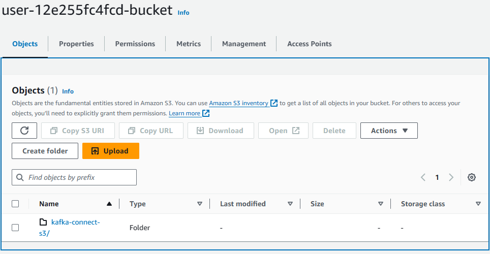
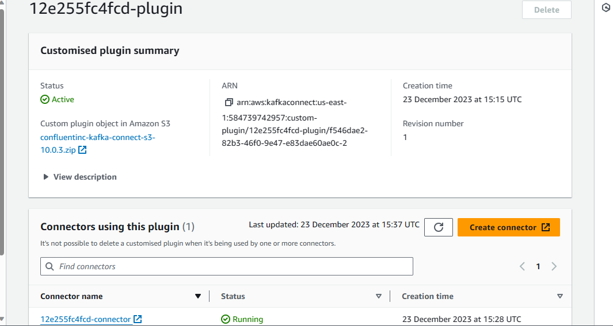

## PinInterest-Data-Pipeline
#Pinterest crunches billions of data points every day to decide how to provide more value to their users. Through the use of AWS Cloud, I will mimick a similar system to handle a similar workload

# Architecture: AWS Managed Services for Kafka (AWS MSK)

## Why AWS MSK

Amazon Managed Streaming for Apache Kafka (Amazon MSK)* is a fully managed service used to build and run applications that use Apache Kafka to process data. Apache Kafka is an open-source technology for distributed data storage, optimized for ingesting and processing streaming data in real-time. 

Apache Kafka clusters are challenging to setup, scale, and manage in production. Amazon MSK makes it easy for you to build and run production applications on Apache Kafka without needing Apache Kafka infrastructure management expertise.

## What Does the data look like? 

Within the PinInterest architecture, I have identitfied three main data structures: which are posts, user and geo data

Posts()
User()
Geo()

## The Data and Kafka

The data will be stored in three topics, <user_id>.pin, <user_id>.geo, <user_id>.user, which will later be fed into further systems in the future. To further seperate out concerns, MSK Connect is a feature of AWS MSK, that allows users to stream data to and from their MSK-hosted Apache Kafka clusters. Therefore to take advantage of this first, Confluent IO needs to be downloaded on the EC2 instance then hosted in a S3 bucket for plugin and connector creation, MSK Connect will continuously monitor the connectors health and delivery state, as well as manage the underlying hardware, and autoscale the connectors to match changes in data load

