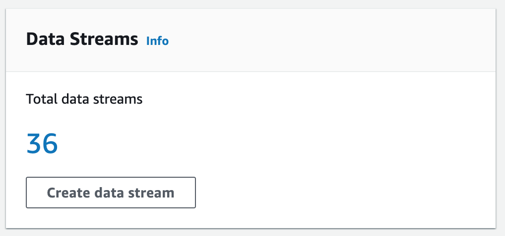

## PinInterest-Data-Pipeline

####  *The Pinterest data pipeline, crunches billions of data points every day to decide and faciliate how to provide more value to their users base. Through the use of cloud providers and a distributed event store and stream-processing platform such as Kafka, I will mimick a data-engineering project that will handle a similar workload*

## Project Dependencies

In order to run this project the following needs to be installed:

* python-dotenv
* sqlalchemy
* requests

If you are using Anaconda and virtual environments (recommended), the Conda environment can be cloned by running the following command, ensuring that env.yml is present in the project:

`conda create env -f env.yml -n $ENVIRONMENT_NAME`

## Tools Used

Apache Kafka - Apache Kafka is an event streaming platform. From the Kafka documentation:

> Event streaming is the practice of capturing data in real-time from event sources like databases, sensors, mobile devices, cloud services, and software applications in the form of streams of events; storing these event streams durably for later retrieval; manipulating, processing, and reacting to the event streams in real-time as well as retrospectively; and routing the event streams to different destination technologies as needed. Event streaming thus ensures a continuous flow and interpretation of data so that the right information is at the right place, at the right time.

AWS MSK - Amazon Managed Streaming for Apache Kafka (Amazon MSK) is 

> a fully managed service that enables you to build and run applications that use Apache Kafka to process streaming data. More information can be found in the developer guide.

AWS MSK Connect - MSK Connect is a feature of Amazon MSK that makes it easy for developers to stream data to and from their Apache Kafka clusters. From the developer guide:

> With MSK Connect, you can deploy fully managed connectors built for Kafka Connect that move data into or pull data from popular data stores like Amazon S3... Use source connectors to import data from external systems into your topics. With sink connectors, you can export data from your topics to external systems.

Kafka REST Proxy - From the docs:

> The Confluent REST Proxy provides a RESTful interface to an Apache Kafka® cluster, making it easy to produce and consume messages, view the state of the cluster, and perform administrative actions without using the native Kafka protocol or clients.

AWS API Gateway -

> Amazon API Gateway is a fully managed service that makes it easy for developers to create, publish, maintain, monitor, and secure APIs at any scale. APIs act as the "front door" for applications to access data, business logic, or functionality from your backend services.

Apache Spark - 

Apache Spark™ is a multi-language engine for executing data engineering, data science, and machine learning on single-node machines or clusters. From the docs:

> Spark provides high-level APIs in Java, Scala, Python, and R, and an optimized engine that supports general execution graphs. It also supports a rich set of higher-level tools including Spark SQL for SQL and structured data processing, pandas API on Spark for pandas workloads, MLlib for machine learning, GraphX for graph processing, and Structured Streaming for incremental computation and stream processing.

PySpark - PySpark is the Python API for Apache Spark.

> It enables you to perform real-time, large-scale data processing in a distributed environment using Python. It also provides a PySpark shell for interactively analyzing your data. PySpark combines Python’s learnability and ease of use with the power of Apache Spark to enable processing and analysis of data at any size for everyone familiar with Python.

Databricks - 

> This project uses the Databricks platform to perform Spark processing of batch and streaming data. From the documentation:
Databricks is a unified, open analytics platform for building, deploying, sharing, and maintaining enterprise-grade data, analytics, and AI solutions at scale. The Databricks Lakehouse Platform integrates with cloud storage and security in your cloud account, and manages and deploys cloud infrastructure on your behalf.

Managed Workflows for Apache Airflow - 

> Apache Airflow enables users to use Python to build scheduling workflows for batch-oriented processes. This project uses MWAA to orchestrate batch processing on the Databricks platform. From AWS docs:
With Amazon MWAA, you can use Apache Airflow and Python to create workflows without having to manage the underlying infrastructure for scalability, availability, and security.

AWS Kinesis - 

> AWS Kinesis is a managed service for processing and analysing streaming data. In this project I've used Kinesis Data Streams to collect and store data temporarily before using Spark on Databricks to read and process the stream


## Architecture: PinInterest Data Pipeline


## The Data:

The kind of data that Pinterest's engineers are working with, is contained in this project, which contains a script, *user_posting_emulation_to_console.py* that is run from the terminal to mimics the stream of random data points received by the Pinterest API when POST requests are made by users uploading data to Pinterest

Running the script instantiates a database connector class, which is used to connect to an AWS RDS database containing the following tables:

* pinterest_data contains data about posts being updated to Pinterest
* geolocation_data contains data about the geolocation of each Pinterest post found in pinterest_data
* user_data contains data about the user that has uploaded each post found in pinterest_data

The run_infinite_post_data_loop() method, infinitely iterates at random intervals between 0 and 2 seconds, selecting all columns of a random row from each of the three tables and writing the data to a dictionary. The three dictionaries are then printed to the console.

<ins>Examples of the three data: <ins>

1. pinterest_data 

`{'index': 7528, 'unique_id': 'fbe53c66-3442-4773-b19e-d3ec6f54dddf', 'title': 'No Title Data Available', 'description': 'No description available Story format', 'poster_name': 'User Info Error', 'follower_count': 'User Info Error', 'tag_list': 'N,o, ,T,a,g,s, ,A,v,a,i,l,a,b,l,e', 'is_image_or_video': 'multi-video(story page format)', 'image_src': 'Image src error.', 'downloaded': 0, 'save_location': 'Local save in /data/mens-fashion', 'category': 'mens-fashion'}`

2. geolocation_data

`{'ind': 7528, 'timestamp': datetime.datetime(2020, 8, 28, 3, 52, 47), 'latitude': -89.9787, 'longitude': -173.293, 'country': 'Albania'}`

3. user_data

`{'ind': 7528, 'first_name': 'Abigail', 'last_name': 'Ali', 'age': 20, 'date_joined': datetime.datetime(2015, 10, 24, 11, 23, 51)}`

## Pre-requistes 


### AWS Identity and Access Management (IAM)

There are two distinct IAM roles that facilite the use of this architecture, EC2 access role [A linnk to EC2 access role configuration](https://docs.aws.amazon.com/AWSEC2/latest/UserGuide/iam-roles-for-amazon-ec2.html) and Kinesis access role [A link to Kinesis access role configuration](https://docs.aws.amazon.com/streams/latest/dev/controlling-access.html)

### Enable client machine to connect to the cluster

In order for the client machine to connect to the cluster, we need to edit the inbound rules for the security group associated with the cluster.

1. In the left-hand EC2 menu, click on 'Security Groups'.
2. Select the security group associated with the Kafka cluster (noted earlier).
3. Select the 'Inbound rules' tab and then click on 'Edit inbound rules'.
4. Click on 'Add rule'. Choose 'All traffic' for the type, and then select the security group associated with the EC2 instance.
Save the rules.

#### We also need to create an IAM role for the client machine.

Navigate to the AWS IAM dashboard, select 'Roles' from the left-hand menu and then click on 'Create role'. 
Select 'AWS service' and 'EC2', then click on 'Next'.
On the next page, select 'Create policy'.
In the policy editor, choose JSON format and paste in the following policy. Note: this policy is somewhat open - a more restrictive policy would be more appropriate for a production environment

```
 {
    "Version": "2012-10-17",
    "Statement": [
        {
            "Sid": "VisualEditor0",
            "Effect": "Allow",
            "Action": [
                "kafka:ListClustersV2",
                "kafka:ListVpcConnections",
                "kafka:DescribeClusterOperation",
                "kafka:GetCompatibleKafkaVersions",
                "kafka:ListClusters",
                "kafka:ListKafkaVersions",
                "kafka:GetBootstrapBrokers",
                "kafka:ListConfigurations",
                "kafka:DescribeClusterOperationV2"
            ],
            "Resource": "*"
        },
        {
            "Sid": "VisualEditor1",
            "Effect": "Allow",
            "Action": "kafka-cluster:*",
            "Resource": [
                "arn:aws:kafka:*:<AWS-UUID>:transactional-id/*/*/*",
                "arn:aws:kafka:*:<AWS-UUID>:group/*/*/*",
                "arn:aws:kafka:*:<AWS-UUID>:topic/*/*/*",
                "arn:aws:kafka:*:<AWS-UUID>:cluster/*/*"
            ]
        },
        {
            "Sid": "VisualEditor2",
            "Effect": "Allow",
            "Action": "kafka:*",
            "Resource": [
                "arn:aws:kafka:*:<AWS-UUID>:cluster/*/*",
                "arn:aws:kafka:*:<AWS-UUID>:configuration/*/*",
                "arn:aws:kafka:*:<AWS-UUID>:vpc-connection/*/*/*"
            ]
        }
    ]
}
```
1. On the next page, give the policy a descriptive name and save the policy.
2. Back in the create role tab in the browser, click refresh to show the new policy and select the policy.
3. Click 'Next', give the role a descriptive name and save the role.
4. In the EC2 dashboard, click on the client instance.
5. Under 'Actions' and 'Security', click on 'Modify IAM role'.
6. Select the role just created and click on 'Update IAM role'.

## Configuring EC2 Kafka client

To Configure an Amazon EC2 instance for Kafka Client, firstly navigate to EC2 services on AWS Management Console.

The setting used to configure the **Amazon machine image** is **amzn2-ami-kernel-5.10-hvm-2.0.20221103.3-x86_64-gp2** which means as follows:

**Amazon Linux 2** AMI. Pre-configured virtual machine image that I can use to launch instances on Amazon Elastic Compute Cloud (Amazon EC2).
**Kernel 5.10**: The AMI is built with Linux kernel version 5.10. This kernel version brings various features, optimizations, and security enhancements.
**HVM (Hardware Virtual Machine)**: HVM is a virtualization mode that allows running guest operating systems directly on the host’s hardware. It provides better performance compared to other virtualization modes.
**x86_64**: 64-bit x86 architecture.
**gp2**: This refers to the General Purpose SSD (gp2) volume type. It provides a balance of performance and cost-effectiveness.

The **instance type** is **t2.micro**

For security reasons, the creation of a key-pair is needed and further to remotely access the EC2 instance. I've made a key-pair.pem file which is ommitted from the repository. This will play a crucial role in maintaining the security and integrity of your EC2 instances and the data they hold.

Due to the key-pair.pem file created earlier Key pairs it will play a significant role in securely accessing the EC2 instance via SSH

## IAM authenticated MSK cluster

MSK cluster configuration settings: 
```
Cluster type: Provisioned
Apache Kafka version: 2.8.1
Broker type: kafka.m5.large
EBS storage volume per broker: 100 GiB
Brokers per zone: 1
Total number of brokers: 3
```

Connect to the EC2 instance via SSH

By using the previous key-pair.pem, connect to the EC2 instance

After connection is successful run this command  `sudo yum install java-1.8.0 `

Download Kafka on to the EC2 instance run this command  `wget https://archive.apache.org/dist/kafka/2.8.1/kafka_2.12-2.8.1.tgz `

Next, navigate to Kafka installation folder and then in the libs folder. Inside here, download the IAM MSK authentication package from Github running this command  `wget https://github.com/aws/aws-msk-iam-auth/releases/download/v1.1.5/aws-msk-iam-auth-1.1.5-all.jar`

Setting up CLASSPATH in `nano ~/.bashrc` and within the bash file add `export CLASSPATH=/home/ec2-user/kafka_2.12-2.8.1/libs/aws-msk-iam-auth-1.1.5-all.jar`, This will ensure that the Kafka client can seamlessly access the Amazon MSK IAM libraries and it will be executed automatically whenever a new session is started for that user.

Within the bin folder of the kafka installation folder, `nano client.properties`, here pass in the ARN role that will be used to connect to the MSK cluster

client.properties:
```
# Sets up TLS for encryption and SASL for authN.

`security.protocol = SASL_SSL`

# Identifies the SASL mechanism to use.

`sasl.mechanism = AWS_MSK_IAM`

# Binds SASL client implementation.

`sasl.jaas.config = software.amazon.msk.auth.iam.IAMLoginModule required awsRoleArn="arn:aws:iam::584739742957:role/12e2$`

# Encapsulates constructing a SigV4 signature based on extracted credentials.

# The SASL client bound by "sasl.jaas.config" invokes this class.

`sasl.client.callback.handler.class = software.amazon.msk.auth.iam.IAMClientCallbackHandler`
```
## Creation of Kafka topics

Creating the following three kafka topics:

12e255fc4fcd.pin for the Pinterest posts data
12e255fc4fcd.geo for the post geolocation data
12e255fc4fcd.user for the post user data

`./kafka-topics.sh --bootstrap-server "b-3.pinterestmskcluster.w8g8jt.c12.kafka.us-east-1.amazonaws.com:9098,b-2.pinterestmskcluster.w8g8jt.c12.kafka.us-east-1.amazonaws.com:9098,b-1.pinterestmskcluster.w8g8jt.c12.kafka.us-east-1.amazonaws.com:9098" --command-config client.properties --create --topic 12e255fc4fcd.pin`

`./kafka-topics.sh --bootstrap-server "b-3.pinterestmskcluster.w8g8jt.c12.kafka.us-east-1.amazonaws.com:9098,b-2.pinterestmskcluster.w8g8jt.c12.kafka.us-east-1.amazonaws.com:9098,b-1.pinterestmskcluster.w8g8jt.c12.kafka.us-east-1.amazonaws.com:9098" --command-config client.properties --create --topic 12e255fc4fcd.geo`

`./kafka-topics.sh --bootstrap-server "b-3.pinterestmskcluster.w8g8jt.c12.kafka.us-east-1.amazonaws.com:9098,b-2.pinterestmskcluster.w8g8jt.c12.kafka.us-east-1.amazonaws.com:9098,b-1.pinterestmskcluster.w8g8jt.c12.kafka.us-east-1.amazonaws.com:9098" --command-config client.properties --create --topic 12e255fc4fcd.user`

## Connect MSK cluster to a S3 Bucket

Use MSK connect to connect MSK cluster to S3 bucket such that any data going through the cluster will be automatically saved and stored in dedicated S3 bucket, this is a sink connector that exports data from Kafka topics to S3 objects

``` 
download connector from Confluent within EC2 instance

wget https://d1i4a15mxbxib1.cloudfront.net/api/plugins/confluentinc/kafka-connect-s3/versions/10.0.3/confluentinc-kafka-connect-s3-10.0.3.zip

# copy connector to S3 bucket
aws s3 cp ./confluentinc-kafka-connect-s3-10.0.3.zip s3://user-12e255fc4fcd-bucket/kafka-connect-s3/
```
In the MSK console and select Custom plugins under the MSK Connect section. Choose Create custom plugin. Create the Custom plugin by selecting the confluent-connect zip inside the S3 bucket


The connector configuration settings are defined as follows: 

```
connector.class=io.confluent.connect.s3.S3SinkConnector
s3.region=us-east-1
flush.size=1
schema.compatibility=NONE
tasks.max=3
topics.regex=12e255fc4fcd.*
format.class=io.confluent.connect.s3.format.json.JsonFormat
partitioner.class=io.confluent.connect.storage.partitioner.DefaultPartitioner
value.converter.schemas.enable=false
value.converter=org.apache.kafka.connect.json.JsonConverter
storage.class=io.confluent.connect.s3.storage.S3Storage
key.converter=org.apache.kafka.connect.storage.StringConverter
s3.bucket.name=user-12e255fc4fcd-bucket
```
## Configuring API in API gateway

### build a kafka rest proxy intergartion for API

Within the EC2 instance 
`sudo wget https://packages.confluent.io/archive/7.2/confluent-7.2.0.tar.gz`
`tar -xvzf confluent-7.2.0.tar.gz`

Configure the REST proxy to communicate with the desired MSK cluster, and to perform IAM authentication, navigate to confluent-7.2.0/etc/kafka-rest. Inside here run the following command to modify the kafka-rest.properties file:

`nano kafka-rest.properties`

Within the properties:

```
#id=kafka-rest-test-server
#schema.registry.url=http://localhost:8081
zookeeper.connect=z-2.pinterestmskcluster.w8g8jt.c12.kafka.us-east-1.amazonaws.com:2181,z-1.pinterestmskcluster.w8g8jt.$bootstrap.servers=b-3.pinterestmskcluster.w8g8jt.c12.kafka.us-east-1.amazonaws.com:9098,b-1.pinterestmskcluster.w8g8jt.$#
# Configure interceptor classes for sending consumer and producer metrics to Confluent Control Center
# Make sure that monitoring-interceptors-<version>.jar is on the Java class path
#consumer.interceptor.classes=io.confluent.monitoring.clients.interceptor.MonitoringConsumerInterceptor
#producer.interceptor.classes=io.confluent.monitoring.clients.interceptor.MonitoringProducerInterceptor
# Sets up TLS for encryption and SASL for authN.
client.security.protocol = SASL_SSL

# Identifies the SASL mechanism to use.
client.sasl.mechanism = AWS_MSK_IAM

# Binds SASL client implementation.
client.sasl.jaas.config = software.amazon.msk.auth.iam.IAMLoginModule required awsRoleArn="arn:aws:iam::584739742957:ro$

# Encapsulates constructing a SigV4 signature based on extracted credentials.
# The SASL client bound by "sasl.jaas.config" invokes this class.
client.sasl.client.callback.handler.class = software.amazon.msk.auth.iam.IAMClientCallbackHandler

```
### Setup API kafka rest

1. Created a resource that allows me to build a PROXY integration for my API.
2. Setup a HTTP ANY method. When setting up the Endpoint URL, Choose PublicDNS, from the EC2 machine

Start the kafka-rest client `./kafka-rest-start /home/ec2-user/confluent-7.2.0/etc/kafka-rest/kafka-rest.properties` within the confluent-7.2.0. This will start the server listening to requests

# Send the data to the API

Within the user_posting_emulation.py file. There is the following class AWSDBConnector, This will be used to connect to the AWS database which will serve as a way to mimic user posting within the PinInterest infastructure

The **init** method within this class defines the key information needed for sqlalchemy to define an engine

The **create_db_connector** method will create an instance of an engine and return said engine

Following this, the method  **run_infinite_post_data_loop** will run forever

`with engine.connect() as connection:` connecting to the engine using a context manager, we define a call to the excute method on connection to extract data from the three following tables pinterest_data, geolocation_data, user_data

This data is extracted randomly by a random row number which is defined as `random_row = random.randint(0, 11000)`

The three calls to the database using the execute method are as follows:

1. `SELECT * FROM pinterest_data LIMIT {random_row}, 1`
2. `SELECT * FROM geolocation_data LIMIT {random_row}, 1`
3. `SELECT * FROM user_data LIMIT {random_row}, 1`

From the CursorResult object, to extract the actual data needed, will by running a for loop to gain access to the result set:

```
for row in pin_selected_row:
                pin_result = dict(row._mapping)
```

This is done for all three calls to the execute method

These results will need to be correctly serialized to a JSON formatted string which can be sent to their respective kafka topics

`payload_pin = json.dumps({ "records": [{"value": pin_result}] }, default= json_serial)`

the default is a customer json_serial which is for objects that are not serializable by JSON in this case it will be for the datetime columns contained in each result set

```
def json_serial(obj):
    """JSON serializer for objects not serializable by default json code"""

    if isinstance(obj, (datetime, date)):
        return obj.isoformat()
    raise TypeError ("Type %s not serializable" % type(obj))

```
Finally to send the data, define the header and the link to the previously created proxy:

`headers = {'Content-Type': 'application/vnd.kafka.json.v2+json'}`

example of one link: `topic_pin = 'https://zoph9lewfc.execute-api.us-east-1.amazonaws.com/test/topics/12e255fc4fcd.pin'`

Finally for the 3 different payloads with their 3 respective links, print out the response give and if its 200, its been correctly sent

```
for payload, invoke_url in zip(payload_list,topic_url_list):
                response = requests.request("POST", invoke_url, headers=headers, data=payload)
                print(response.content)
```

This should now be viewable inside the S3 buckets, where the bucket contains each topic and within each topics subfolder
contains the JSON data: 


## Batch processing data using Apache Spark on Databricks

The previous created topics inside the S3 bucket. Will need to be mounted to gain access for batch processing in Databricks. To achieve this: 

1. Creating an access key and a secret access key for Databricks in AWS
2. Mounting Databricks to a AWS S3 bucket
3. Reading JSON files from mounted S3 bucket

### Creating an access key and secret access key for Databricks

Access the IAM console 


Under user mangement, add user and then attach the existing policy *AmazonS3FullAccess* then skip sections till review page and click create users. 

Now within the security credentials, select create access key:


Now download this secret key for later use in databricks


### Upload credentials to databricks

1. In the Databricks UI, click the Catalog icon and then click + Add --> Add data button. This should redirect you to the following page:


2. Click on Create or modify table and then drop the credentials file you have just downloaded from AWS. Once the file has been successfully uploaded, click Create table to finalize the process.

the credentials will be uploaded in the following location: dbfs:/user/hive/warehouse/.

### Mounting the S3 bucket

In order to batch process the data, it will need to be first mounted to databricks. This is done in this notebook
*[MountingS3Bucket.py](https://github.com/Husseinmdarman/PinInterest-Data-Pipeline/blob/main/Databricks%20Notebooks/MountingS3Bucket.py)* 

The steps carried out in this notebook are as follows:

1.  Check if mount point exists and if it does already it removes it using the method `def sub_unmount(str_path)`
2.  Imports the neccassary libraries
3.  Creates a delta path to the authentication_credentials previously uploaded to databricks
4.  Programatically extract the credentials safely 

``` 
# Get the AWS access key and secret key from the spark dataframe
ACCESS_KEY = aws_keys_df.select('Access key ID').collect()[0]['Access key ID']
SECRET_KEY = aws_keys_df.select('Secret access key').collect()[0]['Secret access key']
# Encode the secrete key
ENCODED_SECRET_KEY = urllib.parse.quote(string=SECRET_KEY, safe="") 

```

5. Next using these credentials, mount the s3 bucket

```
# AWS S3 bucket name
AWS_S3_BUCKET = "user-12e255fc4fcd-bucket"
# Mount name for the bucket
MOUNT_NAME = "/mnt/mount_name_hussein"
# Source url
SOURCE_URL = "s3n://{0}:{1}@{2}".format(ACCESS_KEY, ENCODED_SECRET_KEY, AWS_S3_BUCKET)
# Mount the drive
dbutils.fs.mount(SOURCE_URL, MOUNT_NAME)
```

### Mounted S3 bucket into seperate dataframes 

The mounted S3 bucket contains 3 different topics representing the three key outlined data. This uncleaned data needs to be put into their own respective dataframes which is accomplished with the help of this notebook:

*[LoadingUncleanedTables.py](https://github.com/Husseinmdarman/PinInterest-Data-Pipeline/blob/main/Databricks%20Notebooks/LoadingUncleanedTables.py)* 

This notebook achieves the following: 

1. Using the mounted S3 bucket, the three topics have their own file locations which will need to be set before reading into their respective dataframes

```
file_location_geo = "/mnt/mount_name_hussein/topics/12e255fc4fcd.geo/partition=0/*.json"
file_location_user = "/mnt/mount_name_hussein/topics/12e255fc4fcd.user/partition=0/*.json"
file_location_pin = "/mnt/mount_name_hussein/topics/12e255fc4fcd.pin/partition=0/*.json"
``

2. Using these file location, by assuming the file type will always be json and asking spark to infer the schema. We create the three dataframes

```
### Read in JSONs from mounted S3 bucket
```
df_geo = spark.read.format(file_type) \
.option("inferSchema", infer_schema) \
.load(file_location_geo)

df_user = spark.read.format(file_type) \
.option("inferSchema", infer_schema) \
.load(file_location_user)

df_pin = spark.read.format(file_type) \
.option("inferSchema", infer_schema) \
.load(file_location_pin)
```
3. Finally the use of a globaltempview will enable these tables to be shared across notebooks helping with decoupling the importance of each notebook down to its intended function

```
create global temp views of each uncleaned table to be used for their respective
#cleaning notebooks
df_user.createOrReplaceGlobalTempView("user_uncleaned")
df_geo.createOrReplaceGlobalTempView("geo_uncleaned")
df_pin.createOrReplaceGlobalTempView("pin_uncleaned")
```
## Cleaning the data using spark

The three previously created temp view tables will need to be cleaned before any insight is gained from this data.The cleaning is done in three different notebooks *[CleaningGeoDF.py](https://github.com/Husseinmdarman/PinInterest-Data-Pipeline/blob/main/Databricks%20Notebooks/CleaningGeoDF.py)* ,*[CleaningPinDF.py](https://github.com/Husseinmdarman/PinInterest-Data-Pipeline/blob/main/Databricks%20Notebooks/CleaningPinDF.py)* , *[CleaningUserDF.py](https://github.com/Husseinmdarman/PinInterest-Data-Pipeline/blob/main/Databricks%20Notebooks/CleaningUserDF.py)* 

I will be going through each of the cleaning steps taken in their respective notebooks:

1. CleaningGeoDF: 
Creation of a new column *coordinates* that contains an array based on the *latitude* and *longitude* column
Converting the timestamp column from a string to a timestamp data type
Finally reordering of columns in this order: 'ind','country','coordinates','timestamp'

2. CleaningPinDF

Removal of non relevant data for each column. The non-relevant data has been indentified as the following:


* "description": "No description available",
* "follower_count": "User Info Error",
* "img_src": "Image src error.",
* "poster_name": "User Info Error",
* "tag_list": "N,o, ,T,a,g,s, ,A,v,a,i,l,a,b,l,e",
* "title": "No Title Data Available"

This non-relevant data is stored in a dictionary to be used as a lookup for non-relevant data

```
for column in df_pin.columns: #the column names 
    if (column in pin_df_non_relevant_entries): #checks whether that column name has any specificied entry in non-relevant data
        
        df_pin = df_pin.withColumn(f"{column}", f.when(f.col(f"{column}") == pin_df_non_relevant_entries[column], None).otherwise(f.col(f"{column}"))) 
        #finds the column entry value where its equal to the non-relevant data and changes it to None otherwise it keeps the same value

#due to the in feature being unsuupported the second piece of non-relevant data needs its own line
df_pin = df_pin.withColumn("description", f.when(f.col("description") == "No description available Story format", None).otherwise(f.col("description"))) 

```

The next step, is to change the follower count to an actual number for example 2k is 2000 after cleaning steps taken:
```
#Perform the necessary transformations on the follower_count to ensure every entry is a number. Make sure the data type of this column is an int, the int count has K representing 3 zeros and M representing 6 zeros therefore needs replacing before casting

df_pin = df_pin.withColumn("follower_count", f.regexp_replace('follower_count', r'[k]', '000')) #replaces the value of K with 3 zeros
df_pin = df_pin.withColumn("follower_count", f.regexp_replace('follower_count', r'[M]', '000000')) #replaces the value of M with 6 zeros
df_pin =df_pin.withColumn("follower_count", f.col('follower_count').cast("int")) #can cast the column to a interger now that all values in the string are in a numeric form
```

Next the saved location has the location of the file path but also has a piece of added on that says 'local save in' which needs to be cleaned from every row in that saved location column which is done by 

```
#Clean the data in the save_location column to include only the save location path
df_pin = df_pin.withColumn("save_location", f.regexp_replace('save_location','Local save in ', ''))
```

Next we rename the index column to ind

```
#Rename the index column to ind.
df_pin = df_pin.withColumnRenamed('index', 'ind')
```

Finally we check if all numeric columns are numeric then order the column in this order *"ind", "unique_id", "title", "description", "follower_count", "poster_name", "tag_list", "is_image_or_video", "image_src", "save_location", "category"*

3. CleaningUserDF

Create a new column username by concating the first and last names of each user then drop those two previous columns

```
#Create a new column user_name that concatenates the information found in the first_name and last_name columns
df_user = df_user.withColumn('user_name', f.concat(f.col("first_name"),f.col("last_name")))
#Drop the first_name and last_name columns from the DataFrame

df_user = df_user.drop(*["first_name", "last_name"])

```
Conver the data joined column from string to timestamp datetime and reorder the column

```
#Convert the date_joined column from a string to a timestamp data type
df_user = df_user.withColumn("date_joined", f.to_timestamp("date_joined", format= "yyyy-MM-dd'T'HH:mm:ss"))
#Reorder the DataFrame columns to have the following column order: ind,user_name,age,date_joined
df_user = df_user.selectExpr('ind','user_name','age','date_joined')
```

All three dataframes are now cleaned and ready to process business logic against and again to allow future notebooks to use it across databricks we created a global temp view per table
```
df_user.createOrReplaceGlobalTempView("user")
df_user.createOrReplaceGlobalTempView("geo")
df_user.createOrReplaceGlobalTempView("pin")
```

## Batch processing: Answering Business Questions

Using this cleaned data, the relationships between the data can be used to answer business logic questions. These types of questions and analysis of the data is stored in the following notebook:

*[Questions Answered About Pinterest Data (1).ipynb](https://github.com/Husseinmdarman/PinInterest-Data-Pipeline/blob/main/Databricks%20Notebooks/Questions%20Answered%20About%20Pinterest%20Data%20(1).ipynb)*

## Orchestrating automated workflow of notebook on databricks

MWAA was used to automate the process of running the batch processing on Databricks. The file *[12e255fc4fcd_dag.py](https://github.com/Husseinmdarman/PinInterest-Data-Pipeline/blob/main/12e255fc4fcd_dag.py)* is the Python code for a directed acyclic graph (DAG) that orchestrates the running of the batch processing notebook described above. The file was uploaded to the MWAA environment, where Airflow is utilised to connect to and run the Databricks notebook at scheduled intervals, in this case @daily.


Further in this scenario I have opted to include all the cleaning tasks in their own task groups to avoid any issues downstream when one cleaning task fails, all of them do to minimise any errors in future analysis of the data


## Processing Streaming Data

### Creating streams on kinesis

To mimic streaming data, we will need to send the three pieces of data to their respective streams but before that we will need to create each stream.

1. From the kinesis dashboard select create stream



2. Give the stream name, in this respect it will be user, geo and pin and select 'Provisioned' Capactiy type.

This will mean that there will be three data streams for the three different data we have at hand.


## Stream data down to their respective data streams via API

The API should be able to invoke the following actions:

List streams in Kinesis
Create, describe and delete streams in Kinesis
Add records to streams in Kinesis

Therefore need to build on top of the previously created API for the batch processing data to include streaming data. This resource will need the following kinesis actions

1. ListStreams
2. Create, describe and delete streams in Kinesis
3. Add records to streams in Kinesis

### ListStreams Action made into Resource on API

First we provision a new resource under the API,  which will be named streams

1. For Integration type select AWS Service
2. For AWS Region choose us-east-1
3. For AWS Service select Kinesis,
4. For HTTP method select POST (as we will have to invoke Kinesis's ListStreams action)
5. For Action Type select User action name
6. For Action name type ListStreams
7. For Execution role will be the ARN of your Kinesis Access Role

Next head to URL request headers parameters panel and select the following options:

1. Under Name type Content-Type
2. Under Mapped form type 'application/x-amz-json-1.1'
3. Click the Add request header parameter button

Expand the Mapping Templates panel and select the following options:

1. Choose Add mapping template button
2. Under Content-Type type application/json
3. Under Template body type {} in the template editor

### Create, describe and delete streams in Kinesis.

Within the same resource as the previously created listStreams action, Create another resource named *stream-name* which will further contain the create, describe and delete action names.

The settings used for the DELETE method were:
```
'Integration Type': 'AWS Service'
'AWS Region': 'us-east-1'
'AWS Service': 'Kinesis'
'HTTP method': 'POST'
'Action': 'DeleteStream'
'Execution role': 'arn of IAM role created'
```
In 'Integration Request' under 'HTTP Headers', add a new header:

`'Name': 'Content-Type'`
`'Mapped from': 'application/x-amz-json-1.1'`

Under 'Mapping Templates', add new mapping template:

`'Content Type': 'application/json'`

Use the following code in the template:
```
{
    "StreamName": "$input.params('stream-name')"
}
```

The same setting were used for the create and describe methods where only their mapping template and action names are different

The create method has an action name of CreateStream and mapping template of
```
{
    "ShardCount": #if($input.path('$.ShardCount') == '') 5 #else $input.path('$.ShardCount') #end,
    "StreamName": "$input.params('stream-name')"
}
```
The describe method has a action name of DescribeStream and mapping template of

```
{
    "StreamName": "$input.params('stream-name')"
}

```

### Add records to the stream

Now when adding a record to the stream there are two ways, inputting a single record or multiple records which are defined as action names PutRecord and PutRecords. The have the same configuration as previously with subtle changes to action name and mapping template

/record

PUT
'Action': 'PutRecord'
'Mapping Template':
{
    "StreamName": "$input.params('stream-name')",
    "Data": "$util.base64Encode($input.json('$.Data'))",
    "PartitionKey": "$input.path('$.PartitionKey')"
}
/records

PUT
'Action': 'PutRecords'
'Mapping Template':
{
    "StreamName": "$input.params('stream-name')",
    "Records": [
       #foreach($elem in $input.path('$.records'))
          {
            "Data": "$util.base64Encode($elem.data)",
            "PartitionKey": "$elem.partition-key"
          }#if($foreach.hasNext),#end
        #end
    ]
}
After creating the new resources and methods, the API must be redeployed. To ensure all the changes are made and actve on the API


### Sending Data to the streams

Now that the API and data streams are setup, the script user_posting_emulation_stream_data.py needs some modifications to enable kinesis data to be sent. 
```
kinesis_payload_pin = json.dumps({"StreamName": f'{stream_name_pin}',"Data": pin_result,"PartitionKey": "partition-1"}, default= json_serial)

kinesis_payload_geo = json.dumps({"StreamName": f'{stream_name_geo}',"Data": geo_result,"PartitionKey": "partition-1"}, default= json_serial)

kinesis_payload_user = json.dumps({"StreamName": f'{stream_name_user}',"Data": user_result,"PartitionKey": "partition-1"}, default= json_serial)
```
This code block does the following, it creates JSON payload for each data record. Then packages it ready for consumption by our API 

```
 for kinesis_payload, kinesis_invoke_url in zip(kinesis_payload_list, kinesis_stream_url_list):
                print(kinesis_invoke_url)
                response = requests.request("PUT", kinesis_invoke_url, headers=headers_kinesis, data=kinesis_payload)
                print(response.content)
                print(response.status_code)
```

Finally it sends each record to their respective link in this for loop. 

### Processing the kinesis data

The Jupyter notebook process_kinesis_data_streams.ipynb contains all the code necessary for retrieving the streams from Kinesis, transforming (cleaning) the data, and then loading the data into Delta tables on the Databricks cluster. The steps taken in the code are:

Import necessary functions and types
List tables in Databricks filestore in order to obtain AWS credentials file name
Read the credentials .csv into a Spark dataframe
Generate credential variables from Spark dataframe
Read each three kinesis data stream
Clean all three streams
Display the streams
Write the streams to Delta tables

## Next Steps

To further investigate the relationship between data engineers and data analyst. We can improve this project to further query the streaming data and visualise the data using a tool such as Tableau or Power BI. To further 'production-ise' the code, I'd need to tighten up the IAM policies described